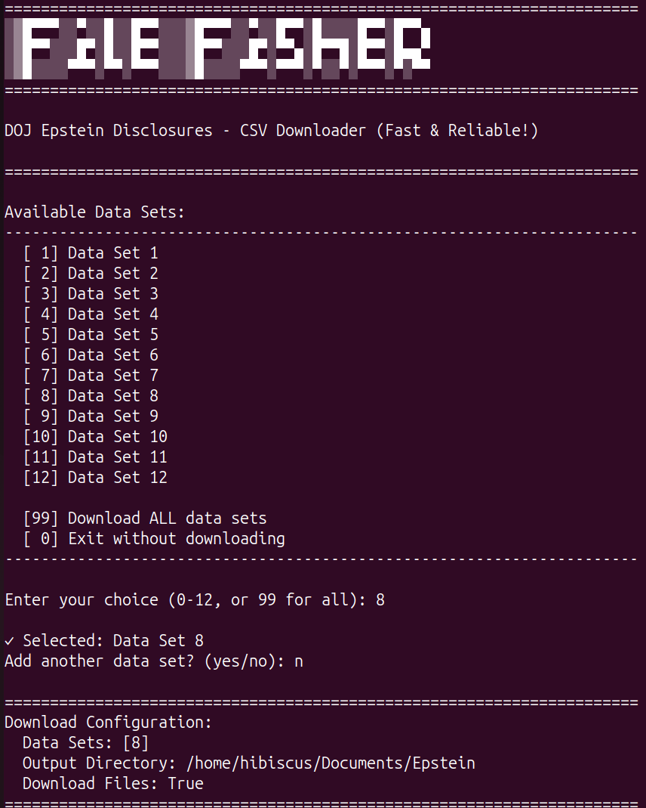

```
░▒█▀▀▀░░▀░░█░░█▀▀░░░▒█▀▀▀░░▀░░█▀▀░█░░░░█▀▀░█▀▀▄
░▒█▀▀░░░█▀░█░░█▀▀░░░▒█▀▀░░░█▀░▀▀▄░█▀▀█░█▀▀░█▄▄▀
░▒█░░░░▀▀▀░▀▀░▀▀▀░░░▒█░░░░▀▀▀░▀▀▀░▀░░▀░▀▀▀░▀░▀▀
```

# File Fisher - DOJ Epstein Disclosures Downloader

**Download documents from the Department of Justice's Epstein Files Transparency Act disclosure portal.**



---

## 🔰 Complete Beginner's Guide - Start Here!

### What Does This Do?

This program automatically downloads public government documents from the DOJ website. Instead of clicking and saving thousands of files one by one, this does it all for you!

### Step 1: Download This Program from GitHub

1. **Look at the top of this page** - You'll see a green button that says **"<> Code"**
2. **Click that green button**
3. **Click "Download ZIP"** at the bottom of the menu
4. **Wait for the download** - It's a small file, about 100 KB
5. **Find the downloaded file** - It's probably in your "Downloads" folder
   - The file is named: `Epstein_File_fisher-main.zip`

### Step 2: Put the Files Somewhere Safe

1. **Open your "Documents" folder**
   - **Windows**: Click the folder icon on your taskbar, then click "Documents"
   - **Mac**: Open Finder, click "Documents" on the left
   - **Linux**: Open your file manager, go to Documents
2. **Right-click on the ZIP file** you downloaded (`Epstein_File_fisher-main.zip`)
3. **Click "Extract All" or "Extract Here"** (the exact wording depends on your computer)
4. **You'll see a new folder** called `Epstein_File_fisher-main`
5. **Optional**: Rename it to just `Epstein_File_fisher` (remove the `-main` part) to make it simpler

### Step 3: Open the Command Line (Terminal)

**This is the black window where you type commands. Don't worry, we'll tell you exactly what to type!**

#### Windows Users:
1. Press the **Windows key** (bottom left of keyboard, looks like ⊞)
2. Type: `cmd`
3. Press **Enter**
4. A black window will open - this is Command Prompt ✅

#### Mac Users:
1. Press **Command + Space** (at the same time)
2. Type: `terminal`
3. Press **Enter**
4. A window will open - this is Terminal ✅

#### Linux Users:
1. Press **Ctrl + Alt + T** (all at the same time)
2. A window will open - this is Terminal ✅

### Step 4: Go to the Folder You Just Extracted

**Now we need to "move" into the folder using the command line:**

**Type these commands EXACTLY as shown and press Enter after each line:**

**Windows:**
```cmd
cd Documents\Epstein_File_fisher-main
```

**Mac/Linux:**
```bash
cd Documents/Epstein_File_fisher-main
```

**If you renamed the folder** (removed `-main`), use this instead:

**Windows:**
```cmd
cd Documents\Epstein_File_fisher
```

**Mac/Linux:**
```bash
cd Documents/Epstein_File_fisher
```

💡 **Tip**: If you see an error like "cannot find the path", make sure:
- You extracted the ZIP file
- You're in the Documents folder
- The folder name matches exactly

### Step 5: Install Python (If You Don't Have It)

**Check if you already have Python:**

**Windows:**
```cmd
python --version
```

**Mac/Linux:**
```bash
python3 --version
```

**If you see something like "Python 3.12.1"** - Great! Skip to Step 6.

**If you see an error**, you need to install Python:

1. Go to: **https://www.python.org/downloads/**
2. Click the big yellow **"Download Python"** button
3. Run the downloaded file
4. **⚠️ IMPORTANT**: Check the box that says **"Add Python to PATH"**
5. Click **"Install Now"**
6. Wait 2-3 minutes
7. Close and reopen your command line window
8. Try the `python --version` command again

### Step 6: Set Up the Program (Only Do This Once)

**Windows - Type this and press Enter:**
```cmd
scripts\setup.bat
```

**Mac/Linux - Type these and press Enter:**
```bash
chmod +x scripts/setup.sh
./scripts/setup.sh
```

**What's happening?**
- This creates a safe space for the program (called a "virtual environment")
- It downloads the helper tools the program needs
- It takes about 1-2 minutes
- You only have to do this ONCE!

### Step 7: Run the Program!

**Windows:**
```cmd
run.bat
```

**Mac/Linux:**
```bash
chmod +x run.sh
./run.sh
```

**You'll see the menu with all 12 data sets!**

### Step 8: Choose What to Download

1. **To test first**: Type `1` and press Enter (downloads Data Set 1 only - about 50 files)
2. **To download everything**: Type `99` and press Enter (downloads all 12 data sets - takes hours!)
3. **To pick specific sets**: Type the number (like `8`) and press Enter

The program will ask: **"Add another data set? (yes/no)"**
- Type `yes` if you want to add more
- Type `no` if you're done selecting

### Step 9: Wait for Download

- You'll see progress bars showing the download
- **DO NOT close the window!**
- You can minimize it and do other things
- The files are being saved to: `Documents/Epstein/`

### Step 10: Find Your Downloaded Files

1. Open your **Documents** folder
2. Open the **Epstein** folder
3. You'll see folders named `data_set_1`, `data_set_2`, etc.
4. Inside each one, files are organized by type:
   - `documents/` - PDF files
   - `videos/` - MP4, MOV files
   - `audio/` - MP3 files
   - `images/` - JPG, PNG files
   - `archives/` - ZIP files

---

## 🌟 Two Download Methods

### Method 1: CSV Downloader (RECOMMENDED) ⭐
- ✅ Direct download links - no bot detection!
- ✅ Reliable and fast (~2 sec/file)
- ✅ 575 files across 12 data sets
- 📖 [CSV Method Guide](docs/CSV_METHOD.txt)

### Method 2: Web Scraper
- ⚠️ May encounter bot detection
- ✅ Auto-discovers new files

## 🚀 Quick Start

```bash
# Setup (run once)
./scripts/setup.sh          # Linux/Mac
scripts\setup.bat           # Windows

# Run
./run.sh                    # Linux/Mac
run.bat                     # Windows

# Or manually
source venv/bin/activate
python src/csv_downloader.py
```

## 🎯 Interactive Menu

The menu allows you to:
- Select individual data sets (1-12)
- Download all data sets at once (option 99)
- Add multiple data sets in one session
- See your download configuration before starting

## 📖 Documentation

- **[Beginner's Guide](docs/BEGINNER_GUIDE.md)** - Step-by-step instructions
- **[CSV Method](docs/CSV_METHOD.txt)** - Recommended download method
- **[Interactive Menu](docs/INTERACTIVE_MENU.txt)** - Menu guide
- **[Quick Reference](docs/QUICK_START.txt)** - All commands

## 📁 Project Structure

```
Epstein_File_fisher/
├── src/                 # Source code
│   ├── csv_downloader.py   # CSV downloader (recommended)
│   ├── scraper.py          # Web scraper
│   └── config.py           # Settings
├── scripts/             # Setup scripts
│   ├── setup.sh
│   └── setup.bat
├── docs/                # Documentation
├── run.sh / run.bat     # Quick run scripts
└── requirements.txt
```

## 💾 Output

Files download to: `~/Documents/Epstein/`

```
Documents/Epstein/
├── data_set_1/
│   ├── documents/  # PDFs
│   ├── videos/     # MP4, MOV
│   ├── audio/      # MP3
│   ├── images/     # JPG, PNG
│   └── archives/   # ZIP
├── data_set_2/
└── ... (12 total)
```

## 🛠️ Requirements

- Python 3.8+
- pip
- ~150 GB free space (for all files)

## 📝 Usage Examples

```bash
# Interactive menu
python src/csv_downloader.py

# Specific data sets
python src/csv_downloader.py --data-sets 1 2 3

# Custom CSV file
python src/csv_downloader.py /path/to/links.csv --data-sets 8

# Metadata only
python src/csv_downloader.py --no-download
```

## ❓ Common Problems and Solutions

### "python is not recognized" (Windows)
**Problem**: You didn't check "Add Python to PATH" during installation.

**Solution**:
1. Uninstall Python (Control Panel → Programs → Uninstall)
2. Download Python again from python.org
3. This time, CHECK THE BOX that says "Add Python to PATH"
4. Install again

### "Permission denied" (Mac/Linux)
**Problem**: The script doesn't have permission to run.

**Solution**:
```bash
chmod +x scripts/setup.sh
chmod +x run.sh
```

### "No such file or directory"
**Problem**: You're not in the right folder.

**Solution**:
1. Type `pwd` (Mac/Linux) or `cd` (Windows) to see where you are
2. Make sure you're in the `Epstein_File_fisher-main` folder
3. Try the `cd Documents/Epstein_File_fisher-main` command again

### Program stops or shows errors
**Solution**:
1. Close the program (press Ctrl+C)
2. Run it again with the same command
3. It will skip files you already downloaded and continue

### Not enough space on computer
**Problem**: You need about 150 GB of free space for ALL data sets.

**Solution**:
- Download one data set at a time (Type `1`, then run again and type `2`, etc.)
- Or buy an external hard drive
- Or delete other large files to make room

### Internet connection problems
**Solution**:
- Make sure you're connected to Wi-Fi
- If it stops, just run the program again - it will continue where it left off

### How do I run it again later?
**Easy!** You don't need to set up again. Just:

1. Open command line (same as Step 3 above)
2. Go to the folder: `cd Documents/Epstein_File_fisher-main`
3. Run the program:
   - Windows: `run.bat`
   - Mac/Linux: `./run.sh`

## ⚠️ Legal Notice

These are public records from the U.S. Department of Justice. Use responsibly for research, journalism, or public interest purposes.

---

I deff used AI for this. :)

